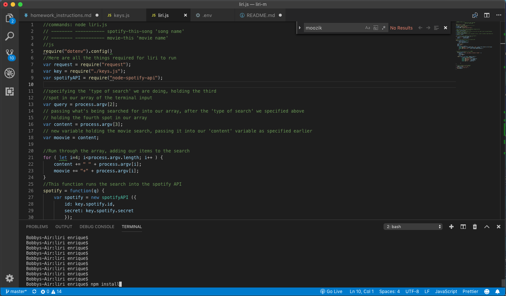
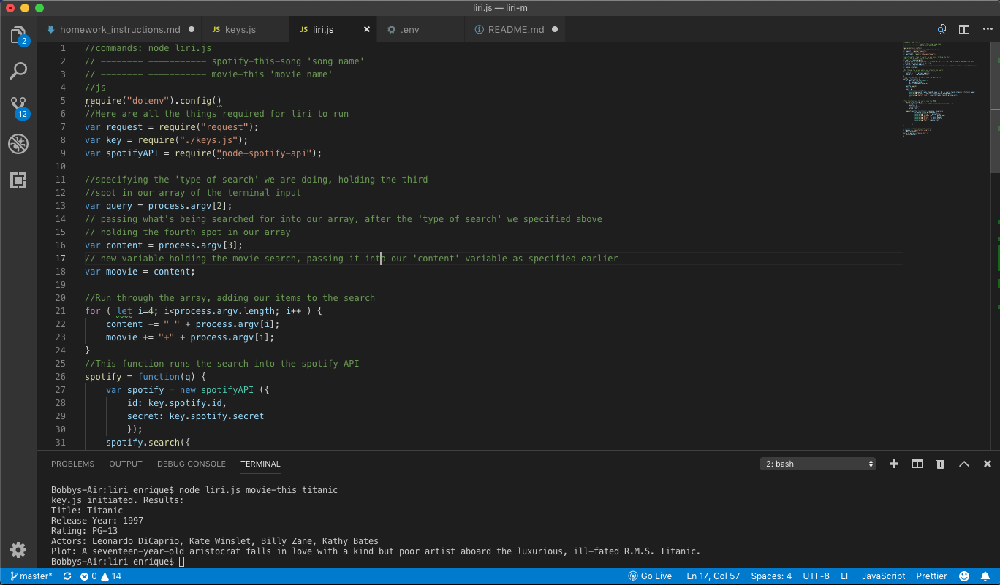
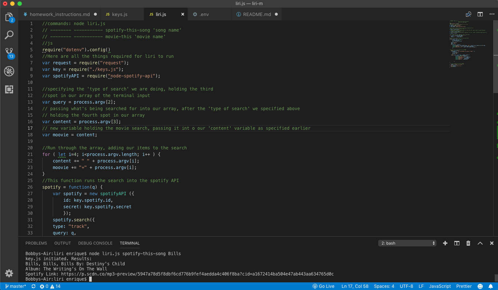

# LIRI Bot

### Overview

In this assignment, you will make LIRI. LIRI is like iPhone's SIRI. However, while SIRI is a Speech Interpretation and Recognition Interface, LIRI is a _Language_ Interpretation and Recognition Interface. LIRI will be a command line node app that takes in parameters and gives you back data.

LIRI will search Spotify for songs, and OMDB for movies.

1. Direct your terminal/command line to the appropriate folder (which contains liri.js) and run the command 'npm install'
    This will install all the necessary files for liri to work

2. You can now run Liri! This iteration of liri takes in two different commands, allowing you to search for information
on movies, or music.

3. To search for information on a movie, type in the following on the command line/terminal : node liri.js movie-this
(after 'movie-this', hit spacebar and type in name of movie, followed by enter/return)

4. To search for information on music, type in the following on the command line/terminal : node liri.js spotify-this-song
(after 'spotify-this-song', hit spacebar and type in name of song, followed by enter/return)
